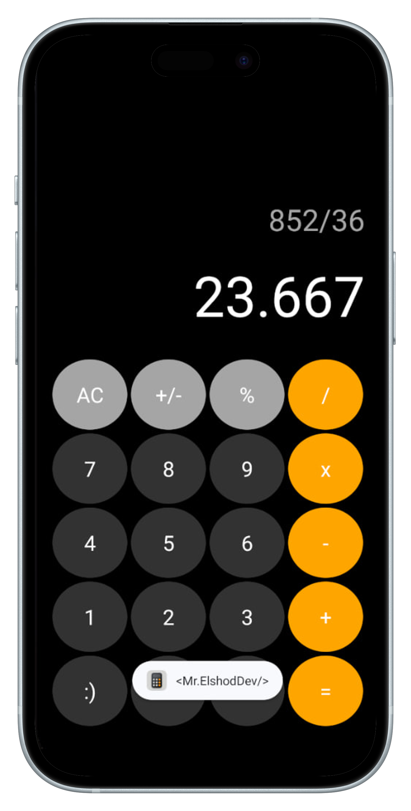

# 📱iOSCalculatorCloneApp
 
- Simple Android clone of the native iOS Calculator built with Kotlin, using modern architecture and tools:

> Custom XML UI mimicking iOS calculator design

> Math expression parsing with exp4j

> Input handling with Kotlin Regex

LiveData for reactive state updates


🧩 Libraries & Utilities

🔢 [exp4j](https://github.com/fasseg/exp4j) by [André Rouél](https://github.com/fasseg) – Lightweight Java library for evaluating mathematical expressions. Used for parsing calculator input.

🧠 LiveData – For reactive UI updates
🔍 Kotlin Regex – For input filtering & validation

📦 Dependency


```gradle
implementation("net.objecthunter:exp4j:0.4.8")
 ```
 🧮 Example to use 
```kotlin
import net.objecthunter.exp4j.ExpressionBuilder

val expression = ExpressionBuilder("2 + 3 * (7 - 1)").build()
val result = expression.evaluate()

println("Result: $result")  // Output: Result: 20.0
```

✅ My Usage

```kotlin
    fun calculate(expression: String): String {
        var calcResult: String = ""
        try {
            var expr = ExpressionBuilder(expression).build().evaluate()


            calcResult = when {
                expr.isNaN() || expr.isInfinite() -> "Undefined"
                expr % 1 == 0.0 -> expr.toInt().toString()
                expr % 1 > 0.0 -> String.format("%.3f", expr)
                else -> expr.toString()
            }
        } catch (e: ArithmeticException) {
            calcResult = "Undefined"

        } catch (e: Exception) {
            calcResult = "Invalid"
        }
        return calcResult
    }
```
#  Assalamu Alaykum Va Rahmatulloh :)
